# Lab 2: Process and Refine Data in AI Data Platform and Lakehouse

## Introduction

This lab builds on Lab 1 by loading sample airline data in ATP, extracting transactional airline data from ATP, processing it through bronze, silver, and gold layers in Oracle AI Data Platform (AIDP) using Spark and Delta Lake, and publishing the refined gold data to Autonomous AI Lakehouse for analytics.

> **Estimated Time:** 1 hour

---

### Objectives

In this lab, you will:
- Load sample airline transactional data into ATP
- Connect AIDP to ATP source and AI Lakehouse
- Extract data from ATP to bronze layer in AIDP
- Clean, enrich, and transform to silver and gold layers
- Publish refined gold data to GOLD schema in AI Lakehouse

---

### Important Note

If multiple users are concurrently working on this workshop, then for different users _01, _02, _03 can be used, instead of using _XX.

For example:
- Use Source\_01, Source\_02, Source\_03 etc instead of Source\_XX
- Use Gold\_01, Gold\_02, Gold\_03 etc instead of Gold\_XX

---

### Prerequisites

This lab assumes you have:
- Completed Lab 1 with ATP and AIDP and Autonomous AI Lakehouse set up
- Access to AIDP

---


## Task 1: Load Sample Airline Data into Source_XX Schema in ATP instance

1. In SQL Developer Web (as Source\_XX in ATP database), create the AIRLINE_SAMPLE table:

```sql
<copy>
CREATE TABLE AIRLINE_SAMPLE (
  FLIGHT_ID   NUMBER,
  AIRLINE     VARCHAR2(20),
  ORIGIN      VARCHAR2(3),
  DEST        VARCHAR2(3),
  DEP_DELAY   NUMBER,
  ARR_DELAY   NUMBER,
  DISTANCE    NUMBER
);
</copy>
```

2. Insert sample data:

```sql
<copy>
INSERT INTO AIRLINE_SAMPLE (FLIGHT_ID, AIRLINE, ORIGIN, DEST, DEP_DELAY, ARR_DELAY, DISTANCE) VALUES (1001, 'Skynet Airways', 'JFK', 'LAX', 10, 5, 2475);
INSERT INTO AIRLINE_SAMPLE (FLIGHT_ID, AIRLINE, ORIGIN, DEST, DEP_DELAY, ARR_DELAY, DISTANCE) VALUES (1002, 'Sunwind Lines', 'ORD', 'SFO', -3, -5, 1846);
INSERT INTO AIRLINE_SAMPLE (FLIGHT_ID, AIRLINE, ORIGIN, DEST, DEP_DELAY, ARR_DELAY, DISTANCE) VALUES (1003, 'BlueJet', 'ATL', 'SEA', 0, 15, 2182);
INSERT INTO AIRLINE_SAMPLE (FLIGHT_ID, AIRLINE, ORIGIN, DEST, DEP_DELAY, ARR_DELAY, DISTANCE) VALUES (1004, 'Quantum Flyers', 'DFW', 'MIA', 5, 20, 1121);
INSERT INTO AIRLINE_SAMPLE (FLIGHT_ID, AIRLINE, ORIGIN, DEST, DEP_DELAY, ARR_DELAY, DISTANCE) VALUES (1005, 'Nebula Express', 'BOS', 'DEN', 12, 8, 1754);
INSERT INTO AIRLINE_SAMPLE (FLIGHT_ID, AIRLINE, ORIGIN, DEST, DEP_DELAY, ARR_DELAY, DISTANCE) VALUES (1006, 'Skynet Airways', 'SEA', 'ORD', -5, -2, 1721);
INSERT INTO AIRLINE_SAMPLE (FLIGHT_ID, AIRLINE, ORIGIN, DEST, DEP_DELAY, ARR_DELAY, DISTANCE) VALUES (1007, 'Sunwind Lines', 'MIA', 'ATL', 7, 4, 595);
INSERT INTO AIRLINE_SAMPLE (FLIGHT_ID, AIRLINE, ORIGIN, DEST, DEP_DELAY, ARR_DELAY, DISTANCE) VALUES (1008, 'BlueJet', 'SFO', 'BOS', 22, 18, 2704);
INSERT INTO AIRLINE_SAMPLE (FLIGHT_ID, AIRLINE, ORIGIN, DEST, DEP_DELAY, ARR_DELAY, DISTANCE) VALUES (1009, 'Quantum Flyers', 'LAX', 'JFK', -1, 0, 2475);
INSERT INTO AIRLINE_SAMPLE (FLIGHT_ID, AIRLINE, ORIGIN, DEST, DEP_DELAY, ARR_DELAY, DISTANCE) VALUES (1010, 'Nebula Express', 'DEN', 'DFW', 14, 20, 641);
INSERT INTO AIRLINE_SAMPLE (FLIGHT_ID, AIRLINE, ORIGIN, DEST, DEP_DELAY, ARR_DELAY, DISTANCE) VALUES (1011, 'Skynet Airways', 'PHX', 'SEA', 3, -2, 1107);
INSERT INTO AIRLINE_SAMPLE (FLIGHT_ID, AIRLINE, ORIGIN, DEST, DEP_DELAY, ARR_DELAY, DISTANCE) VALUES (1012, 'BlueJet', 'ORD', 'ATL', -7, -10, 606);
INSERT INTO AIRLINE_SAMPLE (FLIGHT_ID, AIRLINE, ORIGIN, DEST, DEP_DELAY, ARR_DELAY, DISTANCE) VALUES (1013, 'Quantum Flyers', 'BOS', 'JFK', 9, 11, 187);
INSERT INTO AIRLINE_SAMPLE (FLIGHT_ID, AIRLINE, ORIGIN, DEST, DEP_DELAY, ARR_DELAY, DISTANCE) VALUES (1014, 'Sunwind Lines', 'LAX', 'DFW', 13, 15, 1235);
INSERT INTO AIRLINE_SAMPLE (FLIGHT_ID, AIRLINE, ORIGIN, DEST, DEP_DELAY, ARR_DELAY, DISTANCE) VALUES (1015, 'Nebula Express', 'SFO', 'SEA', 0, 3, 679);
INSERT INTO AIRLINE_SAMPLE (FLIGHT_ID, AIRLINE, ORIGIN, DEST, DEP_DELAY, ARR_DELAY, DISTANCE) VALUES (1016, 'Skynet Airways', 'ATL', 'DEN', 6, 5, 1199);
INSERT INTO AIRLINE_SAMPLE (FLIGHT_ID, AIRLINE, ORIGIN, DEST, DEP_DELAY, ARR_DELAY, DISTANCE) VALUES (1017, 'BlueJet', 'DFW', 'PHX', -2, 1, 868);
INSERT INTO AIRLINE_SAMPLE (FLIGHT_ID, AIRLINE, ORIGIN, DEST, DEP_DELAY, ARR_DELAY, DISTANCE) VALUES (1018, 'Quantum Flyers', 'ORD', 'BOS', 8, -1, 867);
INSERT INTO AIRLINE_SAMPLE (FLIGHT_ID, AIRLINE, ORIGIN, DEST, DEP_DELAY, ARR_DELAY, DISTANCE) VALUES (1019, 'Sunwind Lines', 'JFK', 'MIA', 10, 16, 1090);
INSERT INTO AIRLINE_SAMPLE (FLIGHT_ID, AIRLINE, ORIGIN, DEST, DEP_DELAY, ARR_DELAY, DISTANCE) VALUES (1020, 'Nebula Express', 'DEN', 'ORD', -4, 0, 888);
INSERT INTO AIRLINE_SAMPLE (FLIGHT_ID, AIRLINE, ORIGIN, DEST, DEP_DELAY, ARR_DELAY, DISTANCE) VALUES (1021, 'Skynet Airways', 'SEA', 'ATL', 16, 12, 2182);
INSERT INTO AIRLINE_SAMPLE (FLIGHT_ID, AIRLINE, ORIGIN, DEST, DEP_DELAY, ARR_DELAY, DISTANCE) VALUES (1022, 'BlueJet', 'MIA', 'LAX', 5, 7, 2342);
INSERT INTO AIRLINE_SAMPLE (FLIGHT_ID, AIRLINE, ORIGIN, DEST, DEP_DELAY, ARR_DELAY, DISTANCE) VALUES (1023, 'Quantum Flyers', 'DEN', 'BOS', 2, -2, 1754);
INSERT INTO AIRLINE_SAMPLE (FLIGHT_ID, AIRLINE, ORIGIN, DEST, DEP_DELAY, ARR_DELAY, DISTANCE) VALUES (1024, 'Sunwind Lines', 'SFO', 'JFK', -6, -8, 2586);
INSERT INTO AIRLINE_SAMPLE (FLIGHT_ID, AIRLINE, ORIGIN, DEST, DEP_DELAY, ARR_DELAY, DISTANCE) VALUES (1025, 'Nebula Express', 'ORD', 'MIA', 11, 13, 1197);
</copy>
```

3. Verify the data:

```sql
<copy>
SELECT * FROM AIRLINE_SAMPLE;
</copy>
```

---

## Task 2: Connect AIDP to ATP and AI Lakehouse

1. Navigate to the service console of AIDP - 

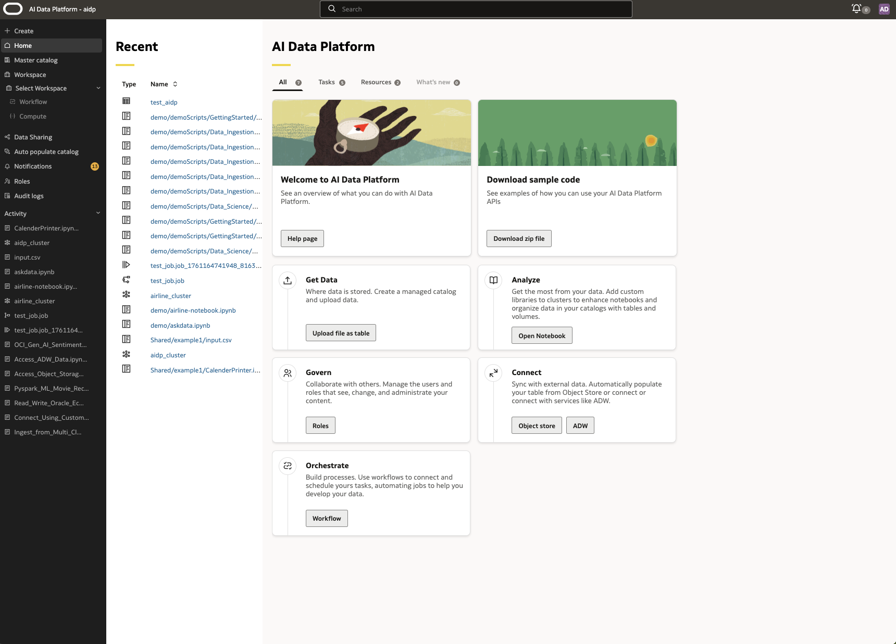

2. Select Create > Catalog 

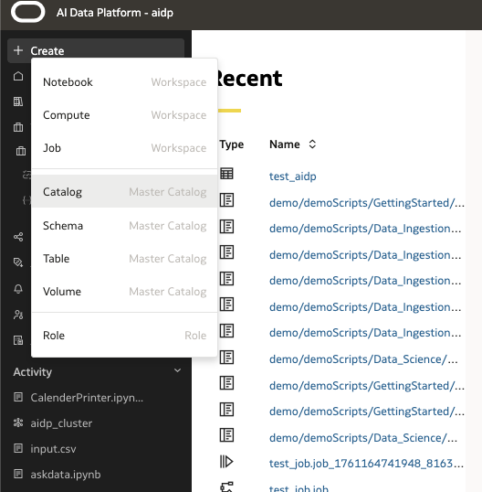

3. For ATP: Provide catalog name (e.g. **atp\_external\_catalog\_xx**), select External Catalog, External source type Oracle Autonomous Transaction Processing, choose your ATP instance, provide Source_XX username and password.

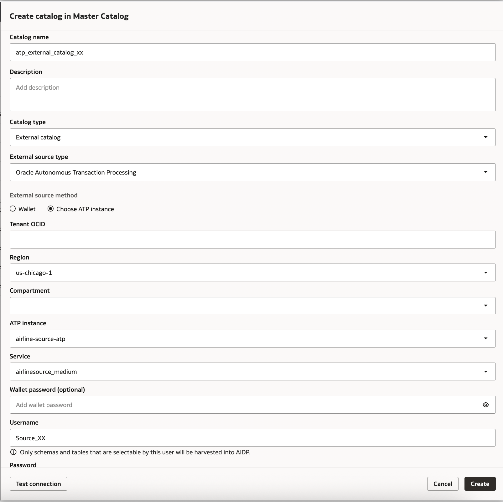

4. For AI Lakehouse: Provide catalog name (e.g. **airlines\_external\_adb\_gold\_xx**), select External Catalog, External source type Oracle Autonomous Data Warehouse, choose your AI Lakehouse instance, provide Gold_XX username and password.

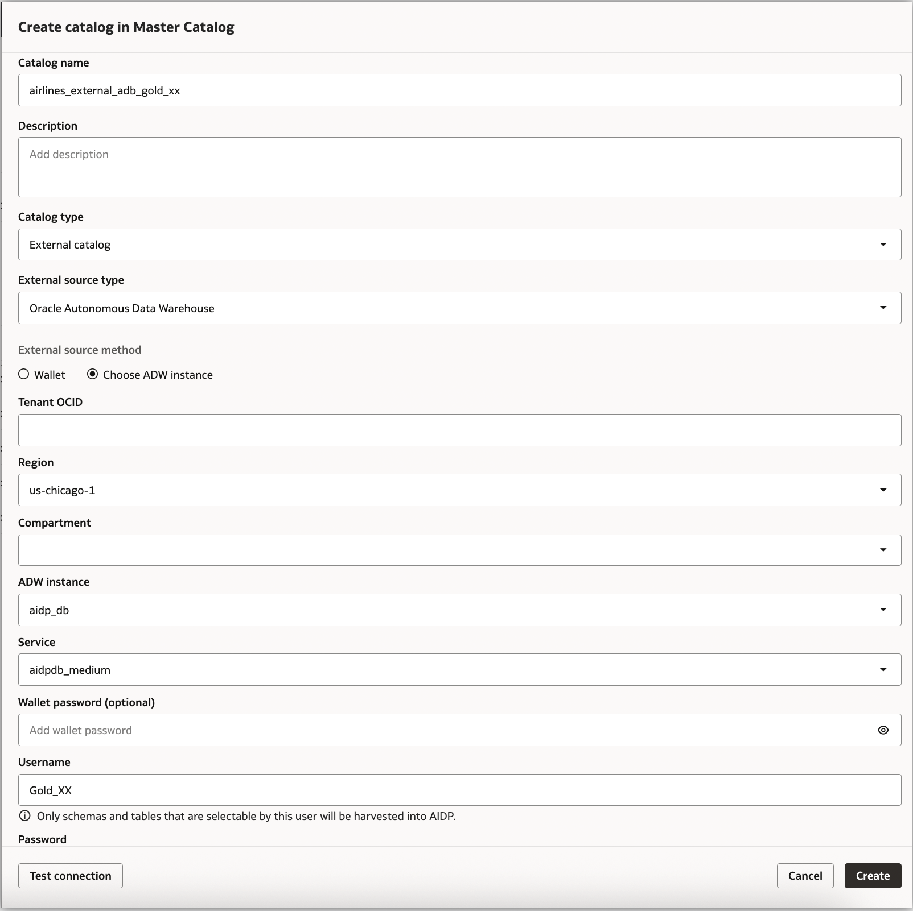

---

## Task 3: Launch AIDP Workspace and Notebook

1. In AIDP, create workspace **airline-workspace_xx** with default catalog **airlines\_external\_adb\_gold\_xx**.

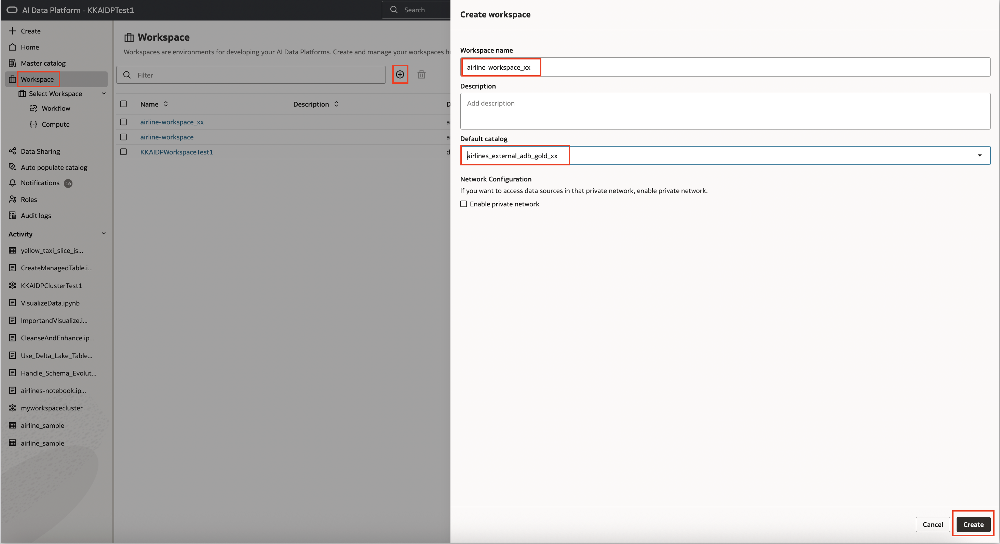

2. Click on the airline-workspace_xx link to navigate to that workspace. Create folder 'demo'.

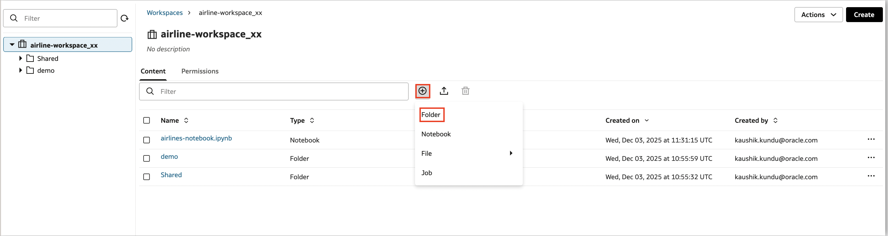

3. Create notebook 'airlines-notebook'.

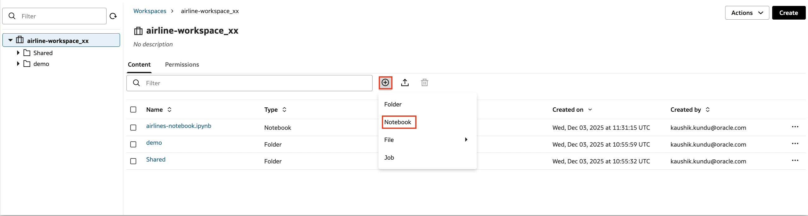

4. Create and attach cluster **my\_workspace\_cluster\_xx**.

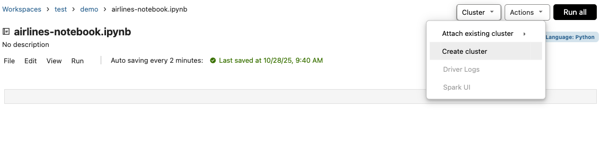

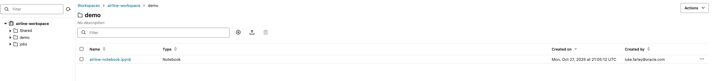

---

## Task 4: Extract from ATP to Bronze Layer

1. In the notebook, confirm ATP table:

```python
<copy>
airlines_sample_table = "atp_external_catalog_xx.source_xx.AIRLINE_SAMPLE"

# Confirm AIRLINE_SAMPLE table is reflected in spark
spark.sql("SHOW TABLES IN atp_external_catalog_xx.source_xx").show(truncate=False)

df = spark.table(airlines_sample_table)

df.show()
</copy>
```

**NOTE** 
For each iteration of code blocks it's recommended to run that section individually to validate the scripts. Once all the code blocks are validated, you can run this entire notebook as a job in a workflow.
For creating next code block in a new cell, click on the "+" icon.

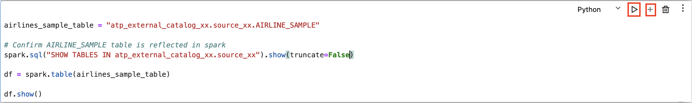

2. Write the new data frame to your Object Storage bucket. Replace '**aidp-demo-bucket_xx**' with your oci bucket name and '**your-os-namespace**' with object storage namespace - 

```python
<copy>
delta_path = "oci://aidp-demo-bucket_xx@your-os-namespace/delta/airline_sample"
df.write.format("delta").mode("overwrite").save(delta_path)
</copy>
```

**NOTE** **aidp-demo-bucket_xx** refers to the bucket name in OCI, and **your-os-namespace** is the namespace found in the bucket - 

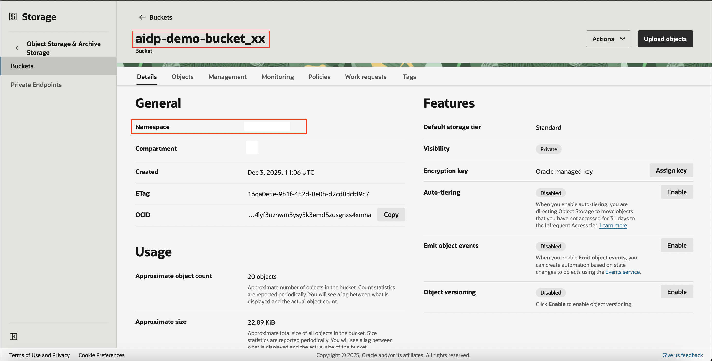

**NOTE** Only one table can be associated with a given delta path. If a table is created on a path that already is associated with another table, it will throw an error. The associated table will have to be deleted then re-write the dataframe to the path. 

3. Create bronze table for first stage of medallian architecture. Here we will create a new (standard) catalog, called "**airlines\_data\_catalog\_xx**". This is distinct from the external catalog to the ATP & AI Lakehouse created earlier. "**airlines\_data\_catalog\_xx**" will be used to store the bronze, silver, and gold layers of the medallian architecture.

```python
<copy>
bronze_table = "airlines_data_catalog_xx.bronze.airline_sample_delta"

# Create New Internal Catalog & Schema to store data
spark.sql("CREATE CATALOG IF NOT EXISTS airlines_data_catalog_xx")
spark.sql("CREATE SCHEMA IF NOT EXISTS airlines_data_catalog_xx.bronze")

# Drop the table if it exists, to avoid conflicts
spark.sql(f"DROP TABLE IF EXISTS {bronze_table}")

# Create new bronze table
spark.sql(f"""
  CREATE TABLE IF NOT EXISTS {bronze_table}
  USING DELTA
  LOCATION '{delta_path}'
""")
</copy>
```

4. Clean the data 

```python
<copy>
spark.sql(f"""
    DELETE FROM {bronze_table}
    WHERE DISTANCE IS NULL OR DISTANCE < 0
""")
</copy>
```

5. Test versioning capabilities of delta tables. With delta lake capabilities the user can now show older versions of tables before they were modified.

```python 
<copy>
df_v0 = spark.read.format("delta").option("versionAsOf", 0).load(delta_path)
df_v0.show()
</copy>
```

---

## Task 5: Create Silver Medallian Schema & Enrich Data with Generative AI 

1. Write to silver schema of medallian architecture 

```python
<copy>
df_clean = spark.table(bronze_table)

silver_path = "oci://aidp-demo-bucket_xx@your-os-namespace/delta/silver/airline_sample"
silver_table = "airlines_data_catalog_xx.silver.airline_sample_delta"

# Create Silver Schema to store data
spark.sql("CREATE SCHEMA IF NOT EXISTS airlines_data_catalog_xx.silver")

# Write cleaned DataFrame to object storage as Delta
df_clean.write.format("delta").mode("overwrite").save(silver_path)

# Remove table registration if it already exists
spark.sql(f"DROP TABLE IF EXISTS {silver_table}")

# Register cleaned data as new Silver table
spark.sql(f"""
  CREATE TABLE {silver_table}
  USING DELTA
  LOCATION '{silver_path}'
""")

# Check table to make sure it's cleaned 
spark.sql(f"SELECT * FROM {silver_table}").show()
</copy>
```

2. Enrich the data 

```python
<copy>
# Enrich data by adding aggregates/average delays and distance 
from pyspark.sql import functions as F

df = spark.table("airlines_data_catalog_xx.silver.airline_sample_delta")

# Calculate averages by airline
avg_df = df.groupBy("AIRLINE").agg(
    F.avg("DEP_DELAY").alias("AVG_DEP_DELAY"),
    F.avg("ARR_DELAY").alias("AVG_ARR_DELAY"),
    F.avg("DISTANCE").alias("AVG_DISTANCE")
)

# Join with the detail table
enhanced_df = df.join(avg_df, on="AIRLINE", how="left")

enhanced_df.show()
</copy>
```

3. Add new column for Sentiment Analysis 

```python
<copy>
# Add New Review Column for Sentiment Analysis 
import random

sample_reviews = [
    "The flight was on time and comfortable.",
    "Long delay and unfriendly staff.",
    "Quick boarding and smooth flight.",
    "Lost my luggage, not happy.",
    "Great service and tasty snacks."
]

from pyspark.sql.functions import udf
from pyspark.sql.types import StringType

random_review_udf = udf(lambda: random.choice(sample_reviews), StringType())
df_with_review = enhanced_df.withColumn("REVIEW", random_review_udf())
df_with_review.show()
</copy>
```

4. Test and run AI model against reviews of flights

```python
<copy>
# test model 
spark.sql("select query_model('cohere.command-latest','What is Intelligent Data Lake Service in Oracle?') as questions").show(truncate=False)

# Run Sentiment Analysis Against Review with LLM 
from pyspark.sql.functions import expr
enhanced_df = df_with_review.withColumn("SENTIMENT",\
                     expr("query_model('cohere.command-latest', concat('What is the sentiment for this review: ', REVIEW))"))\
#.show(10, False)

enhanced_df.show(10, False)
</copy>
```

**NOTE** AIDP as of writing (Nov 2025) supports cohere and grok models. Dragging and dropping the other sample models from the catalog can result in 'model not found' errors. A temporary workaround can be to remove the '**default.oci\_ai\_models**' prefix from the model path. This should be fixed in the near future. 

---

## Task 6: Write Enriched Data to Gold Schema 

1. Save new data to gold schema 

```python
<copy>
# Save Averaged Data to Gold Schema 

gold_path = "oci://aidp-demo-bucket_xx@your-os-namespace/delta/gold/airline_sample_avg"
gold_table = "airlines_data_catalog_xx.gold.airline_sample_avg"

# Create Gold Schema 
spark.sql("CREATE SCHEMA IF NOT EXISTS airlines_data_catalog_xx.gold")

enhanced_df.write.format("delta").option("mergeSchema", "true").mode("overwrite").save(gold_path)

spark.sql(f"DROP TABLE IF EXISTS {gold_table}")

spark.sql(f"""
  CREATE TABLE {gold_table}
  USING DELTA
  LOCATION '{gold_path}'
""")

df_gold = spark.table(gold_table) 
df_gold.show()
</copy>
```

2. Confirm all columns are upper case. This is because OAC requires upper case columns for visualizations, otherwise results in errors. 

```python
<copy>
# Before pushing dataframe, make sure all columns are upper case to prevent visualization issues in OAC
# (OAC needs all columns capitalized in order to analyze data) 
for col_name in df_gold.columns:
    df_gold = df_gold.withColumnRenamed(col_name, col_name.upper())

df_gold.show()
</copy>
```

3. Cast columns to decimal type. This is to conform the spark data frames to the AI Lakehouse column definitions. 

```python
<copy>
from pyspark.sql.functions import col
from pyspark.sql.types import DecimalType, StringType

# Cast columns in the DataFrame to the exact types expected by the Oracle table.
# Use DecimalType for NUMBER fields, StringType for VARCHAR2/text.

df_gold_typed = (
    df_gold
    # Cast numeric columns to DecimalType (matches NUMBER in Oracle)
    .withColumn("FLIGHT_ID", col("FLIGHT_ID").cast(DecimalType(38,10)))
    .withColumn("DEP_DELAY", col("DEP_DELAY").cast(DecimalType(38,10)))
    .withColumn("ARR_DELAY", col("ARR_DELAY").cast(DecimalType(38,10)))
    .withColumn("DISTANCE", col("DISTANCE").cast(DecimalType(38,10)))
    .withColumn("AVG_DEP_DELAY", col("AVG_DEP_DELAY").cast(DecimalType(38,10)))
    .withColumn("AVG_ARR_DELAY", col("AVG_ARR_DELAY").cast(DecimalType(38,10)))
    .withColumn("AVG_DISTANCE", col("AVG_DISTANCE").cast(DecimalType(38,10)))
    # Cast text columns to StringType (matches VARCHAR2 in Oracle)
    .withColumn("AIRLINE", col("AIRLINE").cast(StringType()))
    .withColumn("ORIGIN", col("ORIGIN").cast(StringType()))
    .withColumn("DEST", col("DEST").cast(StringType()))
    .withColumn("REVIEW", col("REVIEW").cast(StringType()))
    .withColumn("SENTIMENT", col("SENTIMENT").cast(StringType()))
)

# Specify the desired column order to match the target Oracle table
col_order = [
    "FLIGHT_ID", "AIRLINE", "ORIGIN", "DEST", "DEP_DELAY", "ARR_DELAY", "DISTANCE",
    "AVG_DEP_DELAY", "AVG_ARR_DELAY", "AVG_DISTANCE", "REVIEW", "SENTIMENT"
]

# Select only these columns, in this order, to create a clean DataFrame for insertion
df_gold_typed = df_gold_typed.select(col_order)

# Print the final DataFrame schema for validation (should match the Oracle table exactly)
print(df_gold_typed.printSchema())

# Register the DataFrame as a temp view for Spark SQL use (for INSERT INTO ... or further queries)
df_gold_typed.createOrReplaceTempView("df_gold")
</copy>
```

---

## Task 7: Create Gold Table and Insert Data

1. In AI Lakehouse SQL Developer, sign in as Gold_XX, create the gold table:

```sql
<copy>
CREATE TABLE AIRLINE_SAMPLE_GOLD (
  FLIGHT_ID   NUMBER,
  AIRLINE     VARCHAR2(20),
  ORIGIN      VARCHAR2(3),
  DEST        VARCHAR2(3),
  DEP_DELAY   NUMBER,
  ARR_DELAY   NUMBER,
  DISTANCE    NUMBER,
  AVG_DEP_DELAY   NUMBER,
  AVG_ARR_DELAY   NUMBER,
  AVG_DISTANCE    NUMBER,
  REVIEW      VARCHAR2(4000),
  SENTIMENT VARCHAR2(200)
);
</copy>
```

2. Back in AIDP notebook, refresh the external catalog "airlines\_external\_adb\_gold\_xx" from Master_Catalog

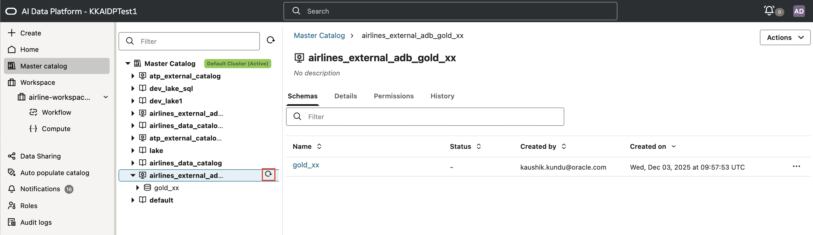

3. Using the airlines-notebook Notebook, insert data:

```sql
<copy>
%sql
INSERT into airlines_external_adb_gold_xx.gold_xx.airline_sample_gold select * from df_gold
</copy>
```

**NOTE** We use the sql insert instead of the native spark insert, because spark causes the dataframe to be pushed with lowercase column names. This results in OAC unable to visualize the data. Using sql INSERT into avoids this issue. 

**TROUBLESHOOTING NOTE:** If you encounter a CONNECTOR_0084 error ("Exception while writing data. Possible cause: Unable to determine if path is a directory") during the INSERT, restart the AIDP workspace cluster and re-run the notebook. This resolves connectivity issues with the external catalog. If this error occurs in other spark code blocks (e.g. when writing to delta lake), re-running the code block usually resolves the issue. 

---

## Next Steps

Proceed to Lab 3 to visualize the gold data in Oracle Analytics Cloud.

---

## Acknowledgements

**Authors**
* **Luke Farley**, Senior Cloud Engineer, ONA Data Platform

**Contributors**
* **Kaushik Kundu**, Master Principal Cloud Architect, ONA Data Platform

**Last Updated By/Date:**
* **Kaushik Kundu**, Master Principal Cloud Architect, ONA Data Platform, December 2025
