# Lab 1: Set Up Source System and Extract Transactional Data

## Introduction

This lab guides you through setting up Oracle Autonomous Transaction Processing (ATP) as the source system for transactional airline data. You'll provision ATP, create a dedicated source schema, and load sample airline data. This establishes a realistic starting point for extracting operational data into the lakehouse pipeline.

> **Estimated Time:** 45 minutes

---

### About Oracle Autonomous Transaction Processing (ATP)

ATP is an autonomous database service optimized for transaction processing (OLTP) workloads, such as storing and managing operational data like flight records. In this workshop, ATP serves as the source system, simulating a real-world transactional database from which data is extracted for analytics.

---

### About Oracle AI Data Platform (AIDP) and Autonomous AI Lakehouse

AIDP enables scalable data engineering with Spark and Delta Lake. Autonomous AI Lakehouse provides fast, secure analytics storage. Together, they form a modern lakehouse for transforming raw data into insights.

---

### Objectives

In this lab, you will:
- Provision an ATP instance
- Create a SOURCE_DATA schema
- Load sample airline transactional data into ATP

---

### Prerequisites

This lab assumes you have:
- An Oracle Cloud account (or provided lab credentials)
- Access to Oracle Autonomous Transaction Processing (ATP)
- Basic familiarity with web-based Oracle Cloud interfaces

---

## Task 1: Provision ATP Instance

1. Log in to your cloud tenancy and navigate to **Oracle AI Database > Autonomous AI Database**

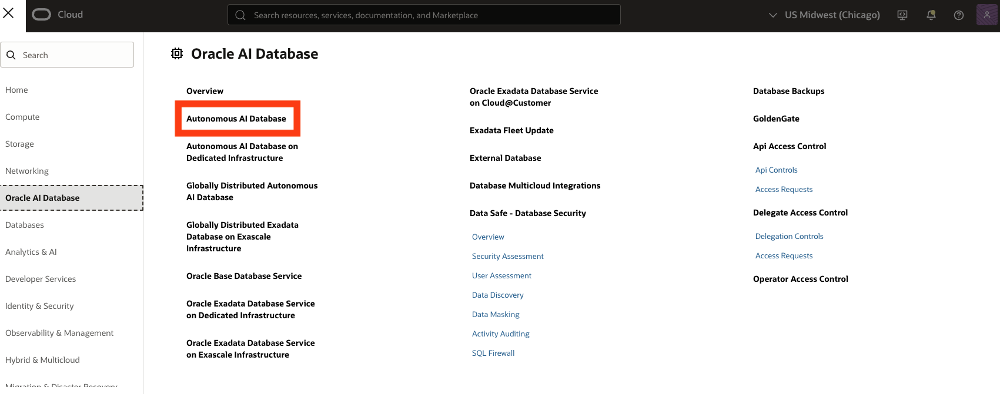

2. Click **Create Autonomous Database**.

3. Provide a display name (e.g., **airline-source-atp**), database name (e.g., **AIRLINESOURCE**), and select **Transaction Processing** as the workload type.

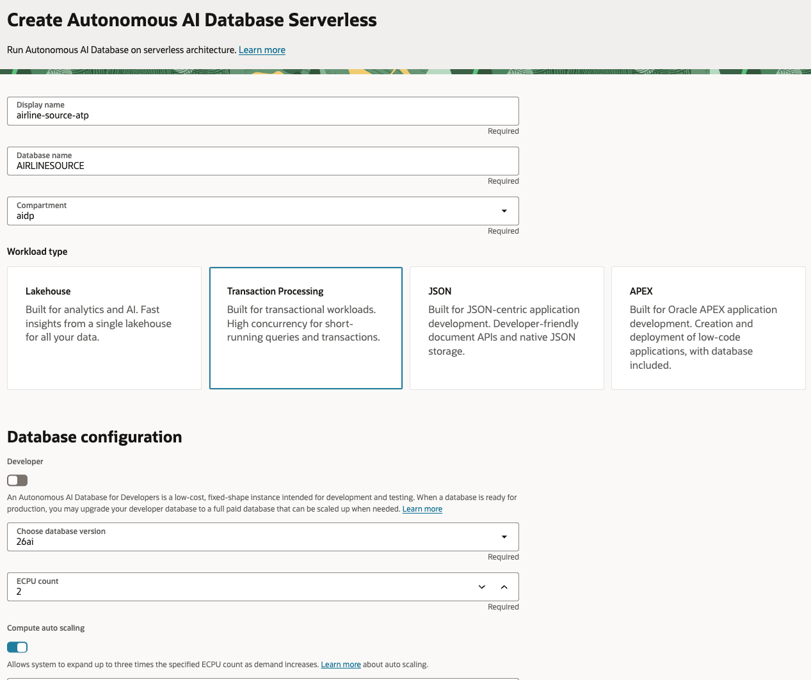

4. Set an administrator password and configure network access as needed (e.g., secure access from everywhere for simplicity).

**NOTE** If you would like to use a private database, a DB Tools Connection will need to be created to use SQL Developer web. This is outside the scope of this lab. For details, see [Create Database Tools Connection](https://docs.oracle.com/en-us/iaas/database-tools/doc/using-oracle-cloud-infrastructure-console.html).

5. Click **Create Autonomous Database**. Provisioning takes a few minutes.

---

## Task 2: Create SOURCE_DATA_01 Schema

1. Once provisioned, navigate to **Database Actions > SQL** in the ATP instance details.

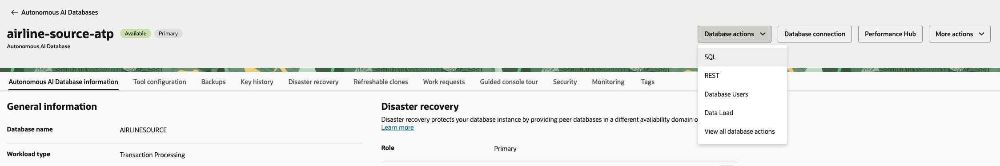

2. Sign in as the ADMIN user.

3. Create the SOURCE_DATA_01 schema (replace "strong\_password" with a secure password):

```sql
<copy>
CREATE USER SOURCE_DATA_01 IDENTIFIED BY "strong_password";
-- Data privileges
GRANT CONNECT, RESOURCE TO SOURCE_DATA_01;

-- Allow creation of tables, views, and other objects
GRANT CREATE SESSION TO SOURCE_DATA_01;
GRANT CREATE TABLE TO SOURCE_DATA_01;
GRANT CREATE VIEW TO SOURCE_DATA_01;
GRANT CREATE SEQUENCE TO SOURCE_DATA_01;
GRANT CREATE PROCEDURE TO SOURCE_DATA_01;
GRANT UNLIMITED TABLESPACE TO SOURCE_DATA_01;

-- Enable DBMS_CLOUD 
GRANT EXECUTE ON DBMS_CLOUD TO SOURCE_DATA_01;

-- Grant access to data_pump_dir (used for saveAsTable operation in spark)
GRANT READ, WRITE ON DIRECTORY DATA_PUMP_DIR TO SOURCE_DATA_01;
</copy>
```

4. Sign out of admin and navigate back to the ATP instance in the console

---

## Task 3: Add REST capabilities to SOURCE_DATA_01 Schema

**NOTE** If unable to sign in directly as SOURCE\_DATA_01 schema, enable REST access

1. Navigate to AI DB > database actions > database users > search for 'SOURCE\_DATA_01' > select three dots > enable rest > log in to sql developer web as SOURCE\_DATA_01

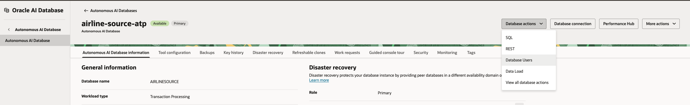

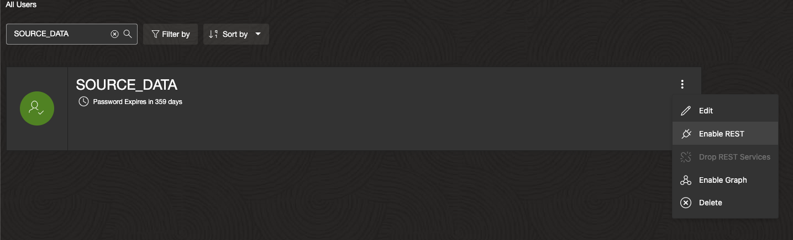

2. Once enabled edit the user and set Quota to Unlimited 

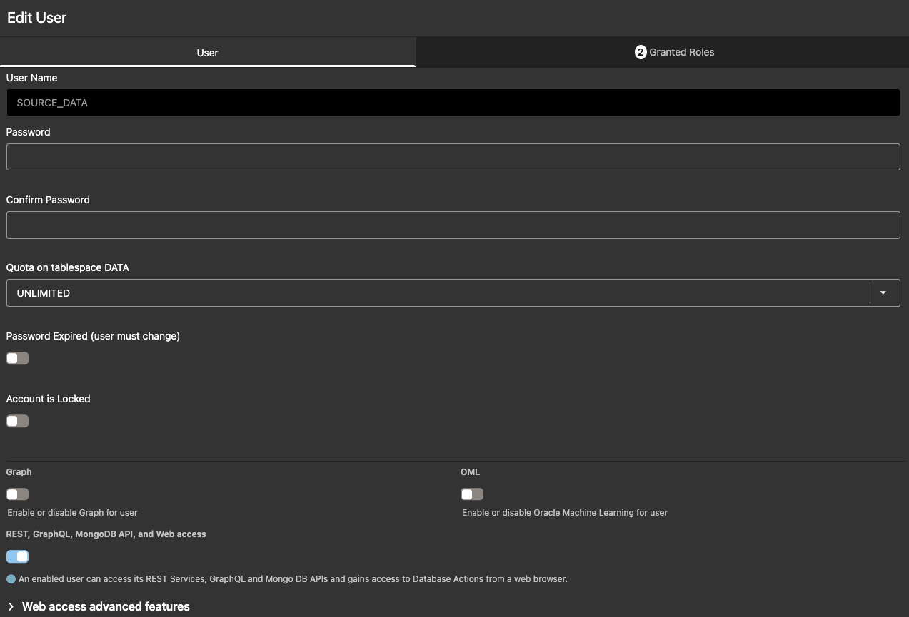

## Task 4: Log in to SQL Developer as SOURCE_DATA_01 Schema 

1. Navigate back to AI DB > database actions > SQL > Once in SQL Developer select ADMIN (top right) > Sign Out

2. Provide SOURCE_DATA_01 as username and give password as defined in previous task. Sign in. 

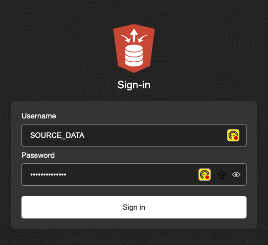

**NOTE** If still unable to log in, try navigating back to database user page and click the following link - 

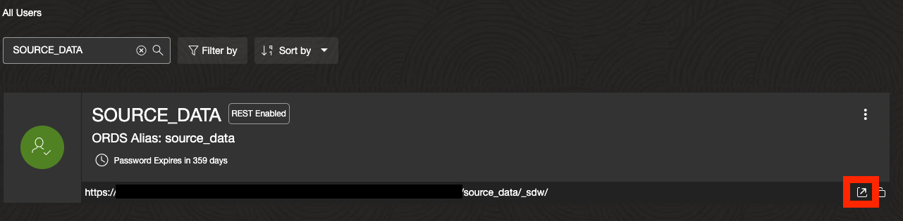

3. Navigate to Development > SQL 

## Task 5: Provision Autonomous AI Lakehouse

1. Log in to your cloud tenancy and navigate to Oracle AI Database > Autonomous AI Database


2. Select Create Autonomous AI Database 

3. Give it a name (e.g. **aidp-db**) and select workload type as Lakehouse. Select database version 26ai and leave other options as default. 

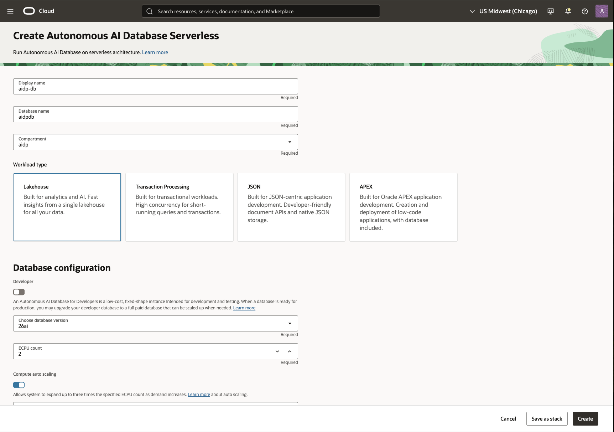

4. Provide a password and set Access Type to 'Secure access from everywhere' 

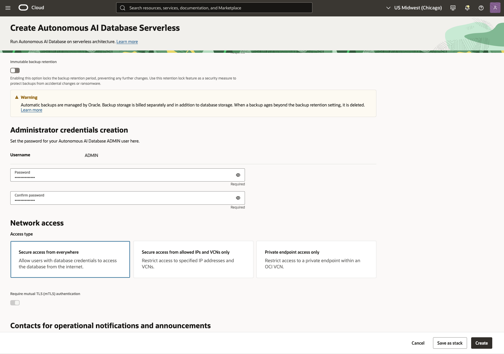

**NOTE** If you would like to use a private database, a DB Tools Connection will need to be created to use SQL Developer web. This is outside the scope of this lab. For details, see [Create Database Tools Connection](https://docs.oracle.com/en-us/iaas/database-tools/doc/using-oracle-cloud-infrastructure-console.html).

5. Create the AI Database. The provisioning process will take a few minutes.

6. Once provisioned, navigate to Database actions > SQL. This will open SQL Developer as admin user. 

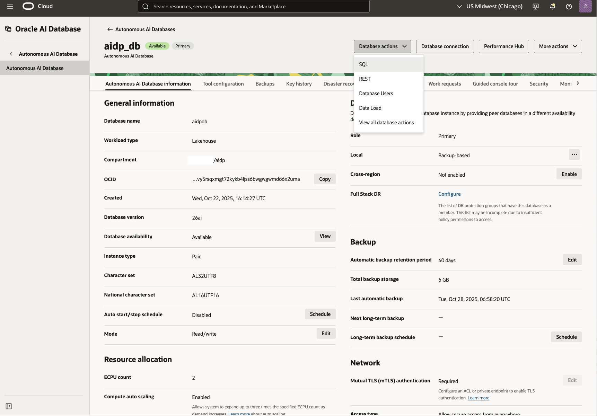

---

## Task 6: Create Gold_01 Schema 

1. Create a Gold_01 Schema (User) in Autonomous Data Lakehouse. Replace "strong\_password" with your own password.

```sql
<copy>
CREATE USER gold_01 IDENTIFIED BY "strong_password";
</copy>
```

2. Grant Required Roles/Privileges to Gold_01 Schema

```sql
<copy>
-- Data privileges
GRANT CONNECT, RESOURCE TO gold_01;

-- Allow creation of tables, views, and other objects
GRANT CREATE SESSION TO gold_01;
GRANT CREATE TABLE TO gold_01;
GRANT CREATE VIEW TO gold_01;
GRANT CREATE SEQUENCE TO gold_01;
GRANT CREATE PROCEDURE TO gold_01;
GRANT UNLIMITED TABLESPACE TO gold_01;

-- Enable DBMS_CLOUD 
GRANT EXECUTE ON DBMS_CLOUD TO gold_01;

-- Grant access to data_pump_dir (used for saveAsTable operation in spark)
GRANT READ, WRITE ON DIRECTORY DATA_PUMP_DIR TO gold_01;
</copy>
```

3. Log out of admin schema once gold_01 schema is created.

## Task 7: Add REST capabilities to GOLD_01 Schema

**NOTE** If unable to sign in directly as gold_01 schema, enable REST access

1. Navigate to AI DB > database actions > database users > search for 'gold_01' > select three dots > enable rest > log in to sql developer web as gold_01

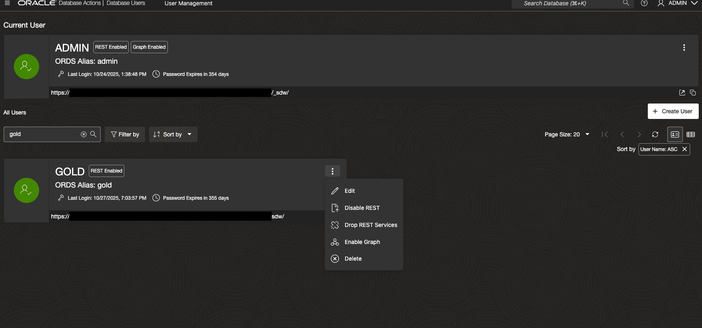

## Task 8: Log in to SQL Developer as GOLD_01 Schema 

1. Navigate back to AI DB > database actions > SQL > Once in SQL Developer select ADMIN (top right) > Sign Out

2. Provide gold_01 as username and give password as defined in previous task. Sign in. 

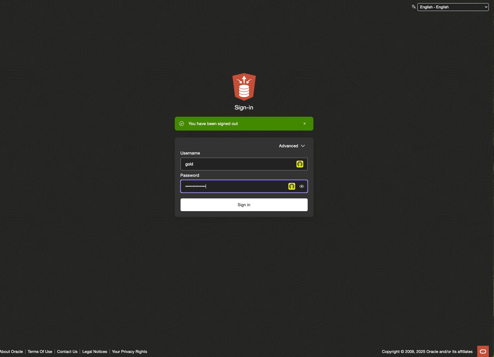

**NOTE** If still unable to log in, try navigating back to database user page and click the following link - 

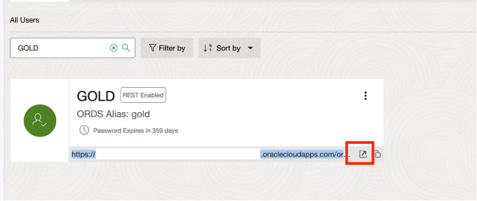

3. Navigate to Development > SQL. Once access is confirmed you can proceed to next task.

## Task 9: Provision AI Data Platform Instance

1. Navigate to Analytics & AI > AI Data Platform 

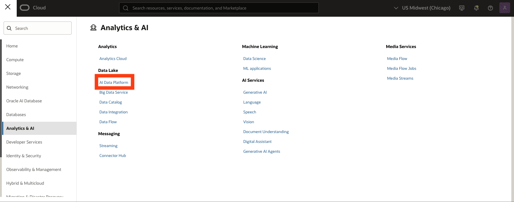

2. Provide a name for AIDP and workspace

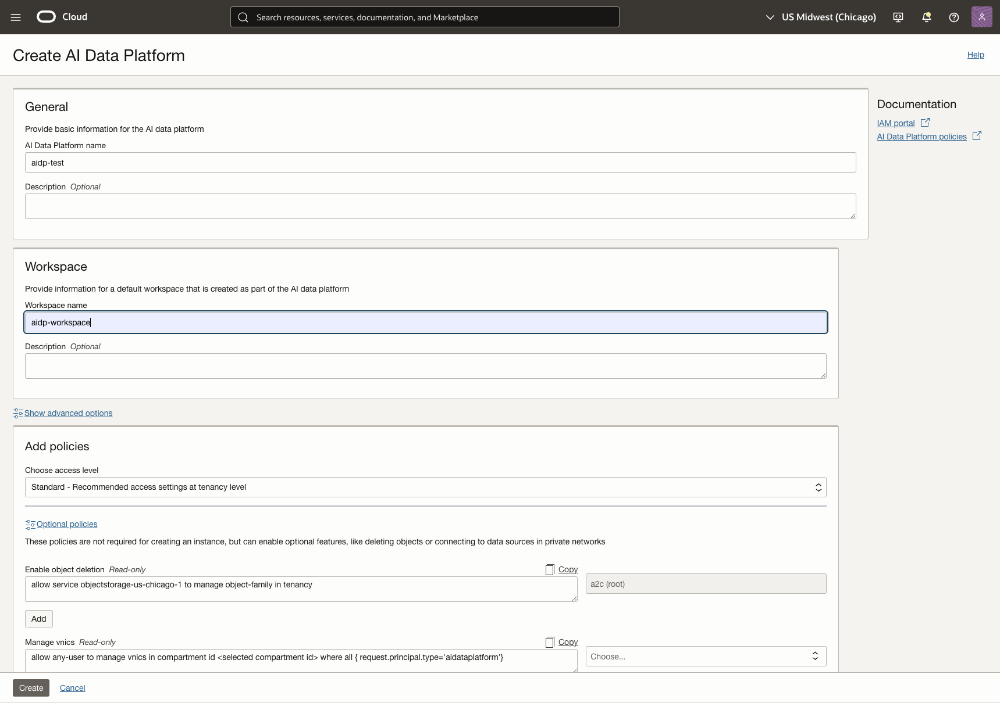

3. Set the access level as standard and explicitly 'Add' the policies. If the policies aren't added it will fail to create. Optional policies can also be added depending on the use case. For this lab, we will need to enable object deletion - 

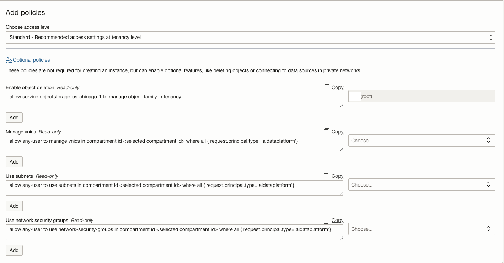

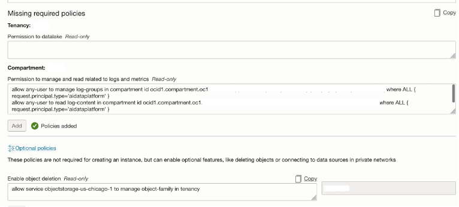

4. Create the instance. This will take a few minutes to provision.

## Task 10: Set Up Object Storage

1. Navigate to **Object Storage** in the OCI Console.

2. Create bucket **aidp-demo-bucket_01** in the AIDP compartment.

3. Create a folder 'delta' in the bucket.

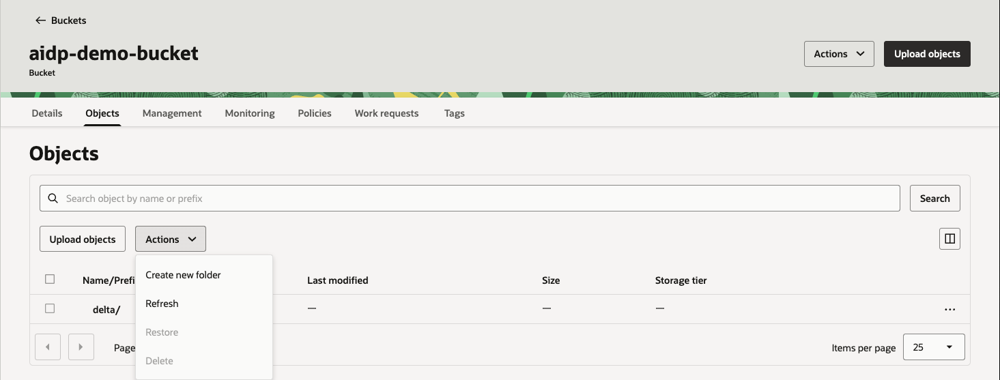

## Next Steps

With the source data loaded in ATP, proceed to Lab 2 to extract and process it in the AI Data Platform and Lakehouse.

---

## Acknowledgements

**Authors**
* **Luke Farley**, Senior Cloud Engineer, ONA Data Platform

**Last Updated By/Date:**
* **Luke Farley**, Senior Cloud Engineer, ONA Data Platform, November 2025