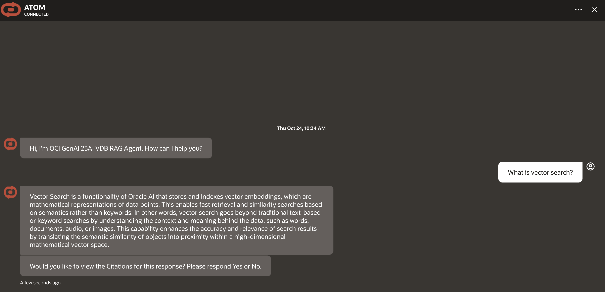
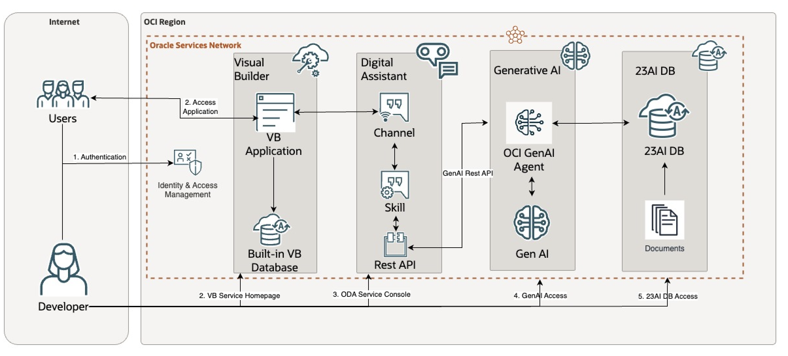

# Introduction

## About this Workshop

This workshop will help to configure multi-agent Generative AI powered chatbot (ATOM) on your own OCI tenancy.
This workshop enables users to perform GenAI RAG on documents stored in different 23ai databases using the OCI Generative AI Agent Service.
The users can then

- Connect to OCI Generative AI Agent Service from OCI Digital Assistant Chatbot (hosted in OCI Visual Builder ATOM Application)
- Get responses of their question (in natural language) from those custom documents.
By following the workshop users can install this ATOM application in their own tenancy

Estimated Workshop Time: 3 hours

### Objectives

Objective of this workshop is to set-up the required OCI services to create a full Generative AI Agent solution with RAG capabilities:

* OCI Generative AI Agent Service – Users can configure OCI Generative AI Agent Service (create and configure Knowledge Bases and Agents).
Users can then ingest and perform RAG on the user’s documents in 23ai database, using OCI Generative AI Agent Service.
* OCI Digital Assistant (ODA) – Users can create ODA instance and import the provided ODA Skill.
Users can then connect from ODA chatbot to OCI Generative AI Agent Service.
* OCI Visual Builder (VB) ATOM Application – User can create OCI Visual Builder (VB) instance and import ATOM VB web application.
Users can then embed the ODA chatbot in ATOM application. Then the users can get responses from their PDF manuals / documents, using the ATOM application.
* OIC Integration Cloud - Users can use tool callouts using Oracle Integration Cloud to pull the weather API

In this workshop, you will learn how to:

* Create Object Storage Bucket, and upload custom PDF documents in those bucket
* Setup & configure Generative AI Agent Service (Knowledge Bases and Agents) conected to that Object Storage Bucket
* Create Autonomous Database 23ai and upload vectorized document content in the database.
* Setup & configure Generative AI Agent Service (Knowledge Bases and Agents) conected to that Autonomous Database 23ai
* Setup & configure OIC to integrate with weather API
* Setup & configure ODA as an LLM powered chatbot
* Setup & configure Visual Builder as a frontend channel for ODA
* Test out the features and capabilities of this ATOM Visual Builder application

### Prerequisites

This lab assumes you have:

* An Oracle Cloud Account
* Access to OCI Generative AI Agents
* Access to a Region where the Agent service is available: Chicago, Frankfurt
* Must have an Administrator Account or Permissions to manage several OCI Services: Generative AI Agents, Digital Assistant, Visual Builder, 23ai database, OIC, OCIR, Network, Dynamic Groups, Policies, IDCS/Identity Domain Confidential Applications, Resource Manager
* Familiarity with Oracle Cloud Infrastructure (OCI) is helpful

## Learn More

* [What Is Generative AI? How Does It Work?](https://www.oracle.com/artificial-intelligence/generative-ai/what-is-generative-ai/)
* [What Is Retrieval-Augmented Generation (RAG)?](https://www.oracle.com/artificial-intelligence/generative-ai/retrieval-augmented-generation-rag/)
* [Overview of Generative AI Service](https://docs.oracle.com/en-us/iaas/Content/generative-ai/overview.htm)
* [Overview of Digital Assistants and Skills](https://docs.oracle.com/en-us/iaas/digital-assistant/doc/overview-digital-assistants-and-skills.html)
* [Overview of Visual Builder](https://docs.oracle.com/en-us/iaas/visual-builder/doc/oracle-visual-builder.html)
* [Oracle Digital Assistant's large language model integration](https://docs.oracle.com/en/cloud/paas/digital-assistant/use-chatbot/llm-blocks-skills.html)

## Acknowledgements

* **Author**
    * **Luke Farley**, Staff Cloud Engineer, NACIE
* **Contributors**
    * **Kaushik Kundu**, Master Principal Cloud Architect, NACIE
