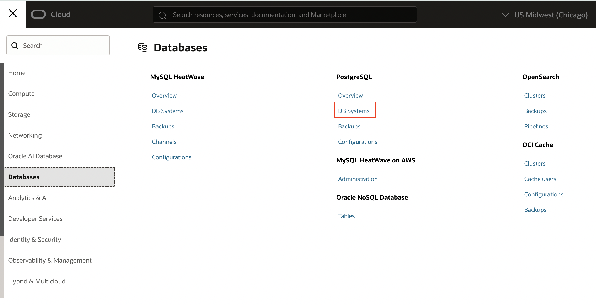
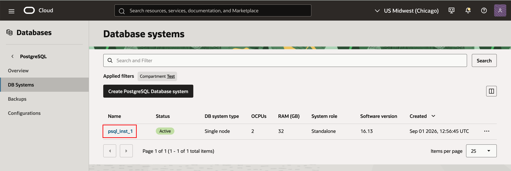
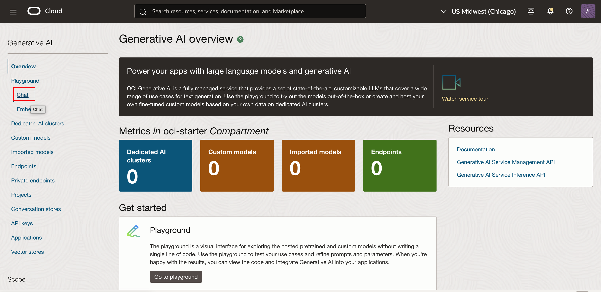
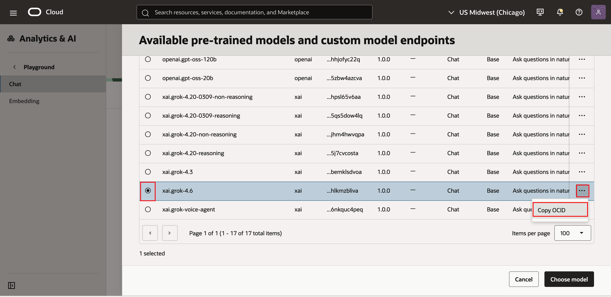
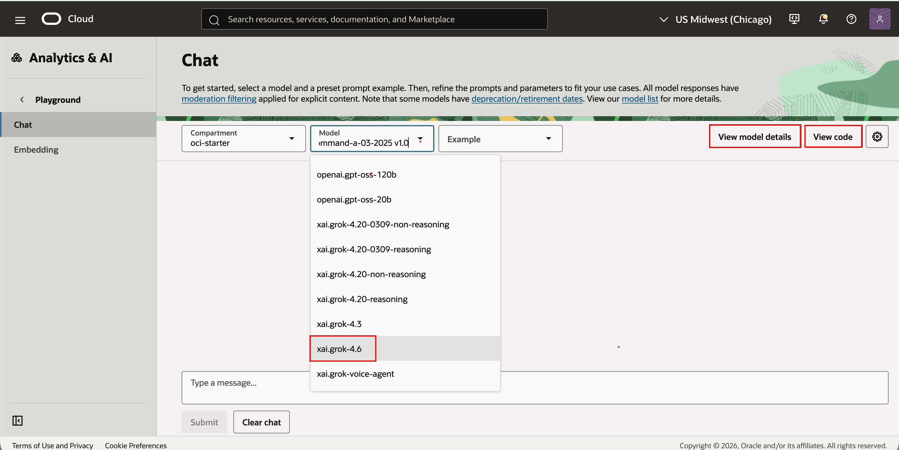

# Install the Components

## Introduction
In this lab, you will install all the components needed for this workshop. Some of these will be provisioned manually and many will be provisioned automatically using a provided Terraform script.

Estimated time: 40 min

### Objectives

- Provision all the cloud components

### Prerequisites

- An OCI Account with sufficient credits where you will perform the lab. (Some of the services used in this lab are not part of the *Always Free* program.)
- Choose which web browser to use before you start. There is an option in a later lab to download a github repo to your local computer using the OCI Console Cloud Shell. Some users have experienced a bug attempting to do this with the Firefox Browser Extended Support Release (ESR). The Chrome browser is an alternative in this case.
- Check that your tenancy has access to the **Chicago or Ashburn or Phoenix Region**
    - For Paid Tenancy
        - Click on region on top of the screen
        - Check that the Chicago (or Ashburn or Phoenix) Region is there (Green rectangle)
        - If not, Click on Manage Regions to add it to your regions list. You need Tenancy Admin right for this.
        - Click on the US MidWest (Chicago)
        - Click Subscribe

    

    - For Free Trial, the home region should be Chicago (or Ashburn or Phoenix)
- The OCI User used in this LiveLab should have OCI Administrator Priviliges in the OCI Tenancy


## Task 1: Create a Compartment

The compartment will be used to contain all the components of the lab.

You can
- Use an existing compartment to run the lab 
- Or create a new one (recommended)

1. Login to your OCI account/tenancy

2. Go the 3-bar/hamburger menu of the console and select
    1. Identity & Security
    1. Compartments
    
    
2. Click ***Create Compartment***
    - Give a name: ***oci-starter_XX*** (where XX is the initial of the user working on this LiveLab)
    - Then again: ***Create Compartment***
    

## Task 2: Create OCI API Key

The API key will be used to access OCI command line tool and OCI Enterprise AI service programatically 

1. Go to OCI Console Homepage

2. Click User icon on the top right and *User Settings*

    
    
3. Go to *Tokens & Keys*, then *Add API Key*
    
    
4. Generate API PEM Key pair and Download the Private an Public Key. 
    

    This key will be used as API signing key in the config file
    
5. Generate SSH Private/Public Key pair using the following command
    ````
    ssh-keygen -t rsa -f <Your_Folder_Path>/id_rsa
    ````
    This key will be used to connect to the Compute VM


## Task 3: Run Terraform script 

1. Review and accept the license agreement before downloading the GitHub code to your local machine.

    <div class="sample-code-license-gate" data-license-gate>
      <p>Review the Oracle Technology Network License Agreement in Appendix 1, then select <strong>Accept License Agreement</strong> to reveal the download command.</p>
      <button type="button" class="license-gate-review" data-license-gate-review>Review License Agreement</button>
      <p class="license-gate-status" data-license-gate-status aria-live="polite"></p>
    </div>

    <div class="sample-code-clone license-gate-is-hidden" data-license-gated-clone aria-hidden="true">
      <pre><code>git clone https://github.com/kaushik-kundu/PostgreSQL-AI.git</code></pre>
    </div>


       
2. Go to OCI Console Home Page

3. Click on *Developer Services* and then *Stack*
    

4. Change your compartment to the one created in Task 1 above

5. Select *My Configuration* scroll down to the *Stack Configuration* and add the newly downloaded folder
       
       
   Select the *oci_postgres_tf_stack* folder from your local machine
       
       
6. Select the compartment and click **Next**
       

7. Ensure that the "compartment_ocid" is set correctly. Select the **compute assign public ip** option
          

8. Paste the Public SSH key created in Task 2 (Step 5) and check **create compute** | **create\_psql\_configurtion** box

    Ensure object_storage_bucket_name is set as "search-app-uploads_XX" (where XX is the initial of the user working on this LiveLab)

    

9. pgvector extension and user variables added
     

10. Enter Postgres Admin user and password
              

11. Ensure that the region is correctly set, and click next
              

12. Select *Run apply* and create the stack
              

13. Wait about 10-15 minutes for the stack to finish provisioning
              
              

Copy the last 10 lines of the job log and save it in a notepad, it will be like something below

````
Outputs:
compute_instance_id = "ocid1.instance.oc1.iad.anuw...................uq"
compute_private_ip = "10.10.2.23"
compute_public_ip = "150.x.x.74"
compute_state = "RUNNING"
psql_admin_pwd = <sensitive>
psql_configuration_id = "ocid1.postgresqlconfiguration.oc1.iad.amaaaaa............snq" 
````


14. Go to OCI Console *Compute* and then *Instances*
              

Copy the public IP of the instance 
              

15. Go to OCI Console *Databases -> PostgreSQL -> DB Systems*

    

    Click on the database name to view the details

    

    Note the DB Primary endpoint

    

16. Go to OCI Console *Analytics & AI -> AI Services -> Generative AI*

    

    Click on *Chat*

    

    Select the LLM Model you want to use for this LiveLab, and then click on *View model details*

    

    Scroll down and Copy OCID to get the OCID of this LLM Model of OCI Enterprise AI.

    

    Optionally, you can also click on View Code, and note the OCID from the code

    
    

    Make a note of this OCID

## Task 4: Upload Key

1. Go to your Terminal and copy the public IP (from Task 3 step 14) and use the Private SSH Key (from Task 2 Step 5)

2. In your local machine, make a copy of the private PEM key file (downloaded in Task 2 Step 4), and rename it to priv.key

3. Use SCP to copy the key file priv.key file to "/home/opc/" within the compute host.

    Replace with your Private SSH Key File Name (downloaded in Task 2 Step 5) and your Public IP in the following command

    ````
    scp -i <Private Key> priv.key opc@<Public IP>:/home/opc/
    ````

## Task 5: Setup Application

1. Go to your Terminal and copy the public IP from Task 3 step 14 and use the Private SSH Key from Task 2 (Step 5), to connect to the host by SSH.

    Replace with your Private Key File Name and your Public IP in the following command

    ````
    ssh -i <Private Key> opc@<Public IP>
    ````

      

2. Install Linux Packages
   
````
sudo dnf install -y curl git unzip firewalld oraclelinux-developer-release-el10 python3-oci-cli postgresql16
````

3. Add firewall rules
   
````
# uv installer and PATH
curl -LsSf https://astral.sh/uv/install.sh | sh
export PATH="$HOME/.local/bin:$PATH"

# Firewalld rules for the app port (default 8000)
sudo systemctl enable --now firewalld
sudo firewall-cmd --permanent --add-port=8000/tcp
sudo firewall-cmd --reload
````

4. Download the Code Repository to the compute instance. Use the license agreement above to reveal this command.

    <div class="sample-code-clone license-gate-is-hidden" data-license-gated-clone aria-hidden="true">
    <pre><code>git clone https://github.com/kaushik-kundu/PostgreSQL-AI.git</code></pre>
    </div>

5. Setup OCI ClI

    Change the permission of the priv.key file at /home/opc/priv.key

````
chmod 600 /home/opc/priv.key
````

````
oci setup config
````

Enter the details as per Task 2 Step 4

````
Enter a location for your config [/home/opc/.oci/config]:
Enter a user OCID: ocid1.user.oc1..aaaaaa...........................aq
Enter a tenancy OCID: ocid1.tenancy.oc1..aaaaaaaa....................ua
Enter a region by index or name(e.g.) :  us-ashburn-1

Enter the location of your API Signing private key file: /home/opc/priv.key

Config written to /home/opc/.oci/config
    If you haven't already uploaded your API Signing public key through the
    console, follow the instructions on the page linked below in the section
    'How to upload the public key':

        https://docs.cloud.oracle.com/Content/API/Concepts/apisigningkey.htm#How2
````

6. Configure the variables to reflect the provisioned stack and API keys

````
cd PostgreSQL-AI/search-app/
````

````
vi .env.example
````

Add DB Parameters based on the DBSystem created earlier

````
DB_HOST=<DB_Host value from Task 3 Step 15>
DB_PORT=5432
DB_NAME=postgres
DB_USER=postgres OR <Your Postgres Admin Name from task 3 Step 10>
DB_PASSWORD=<Your Postgres Password from task 3 Step 10>
DB_SSLMODE=require
DB_POOL_MIN_SIZE=1
DB_POOL_MAX_SIZE=10
````

Set Security (Basic Auth) parameters
````
BASIC_AUTH_USER=admin
BASIC_AUTH_PASSWORD=<Set your password>
````


Add OCI cli parameters based on the API Key created earlier

OCI_GENAI_MODEL_ID can be set to the OCID received in Task 3 Step 16

````
# Set oci
LLM_PROVIDER=oci

# OCI Enterprise AI (when LLM_PROVIDER=oci)
OCI_REGION=us-chicago-1
OCI_COMPARTMENT_OCID=ocid1.compartment.oc1..aaaaaaaad........................mfa
OCI_GENAI_ENDPOINT=https://inference.generativeai.us-chicago-1.oci.oraclecloud.com
OCI_GENAI_MODEL_ID=ocid1.generativeaimodel.oc1.us-chicago-1.amaaaaaask7d.......zta
#
# Option 1: Use config file
OCI_CONFIG_FILE=/home/opc/.oci/config
OCI_CONFIG_PROFILE=DEFAULT
# Option 2: API key envs
OCI_TENANCY_OCID=
OCI_USER_OCID=
OCI_FINGERPRINT=
OCI_PRIVATE_KEY_PATH=
OCI_PRIVATE_KEY_PASSPHRASE=
````

7. Copy environment variables in example file to .env file

````
cd /home/opc/PostgreSQL-AI/search-app

cp -p .env.example .env
````

8. Run the Stack

````
bash run.sh
````


After the app has completed startup, open a browser with the public IP of the VM with tcp/8000

````
http://128.x.x.54:8000/
````

Enter the API Auth User and Password set in the **.env.example** file earlier


**You may now proceed to the [next lab](#next)**

## Known issues

None

## Acknowledgements

- **Created By/Date** - Shadab Mohammad, Master Principal Cloud Architect, January 2026
- **Last Updated By** - Kaushik Kundu, Master Principal Cloud Architect, September 2026

