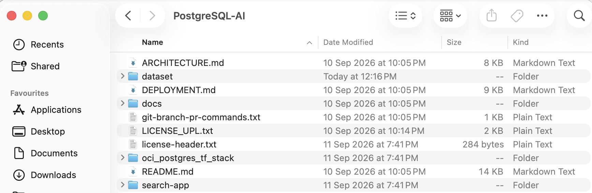
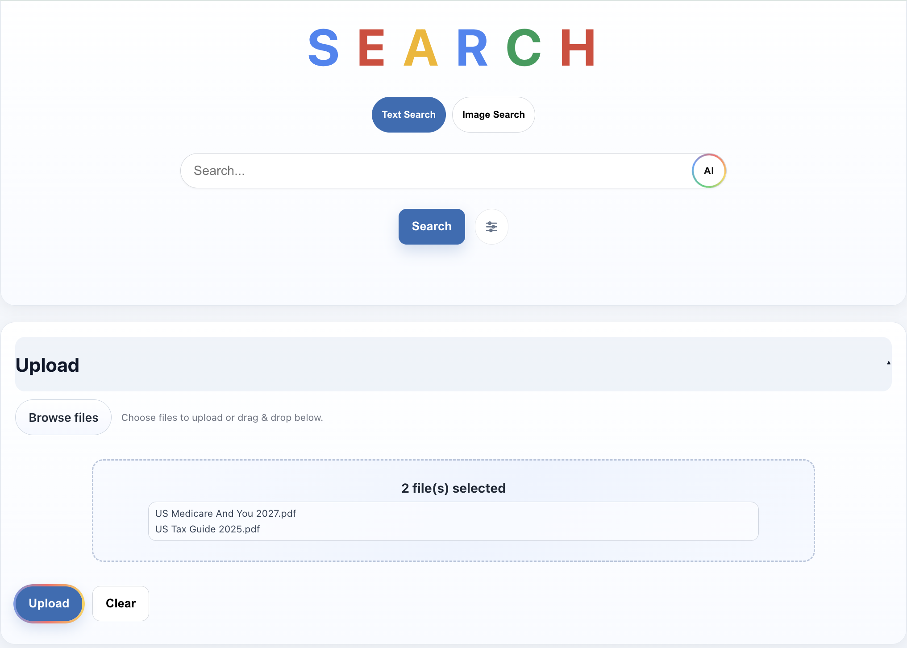
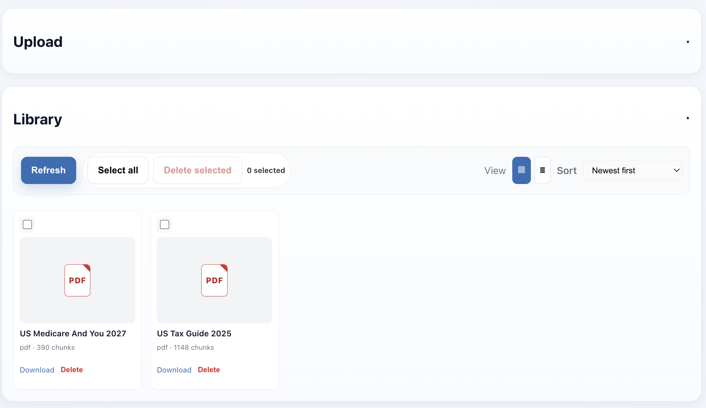
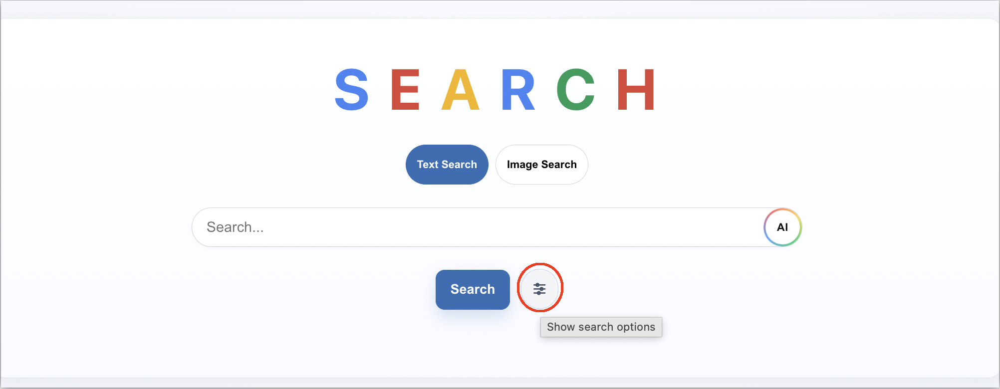
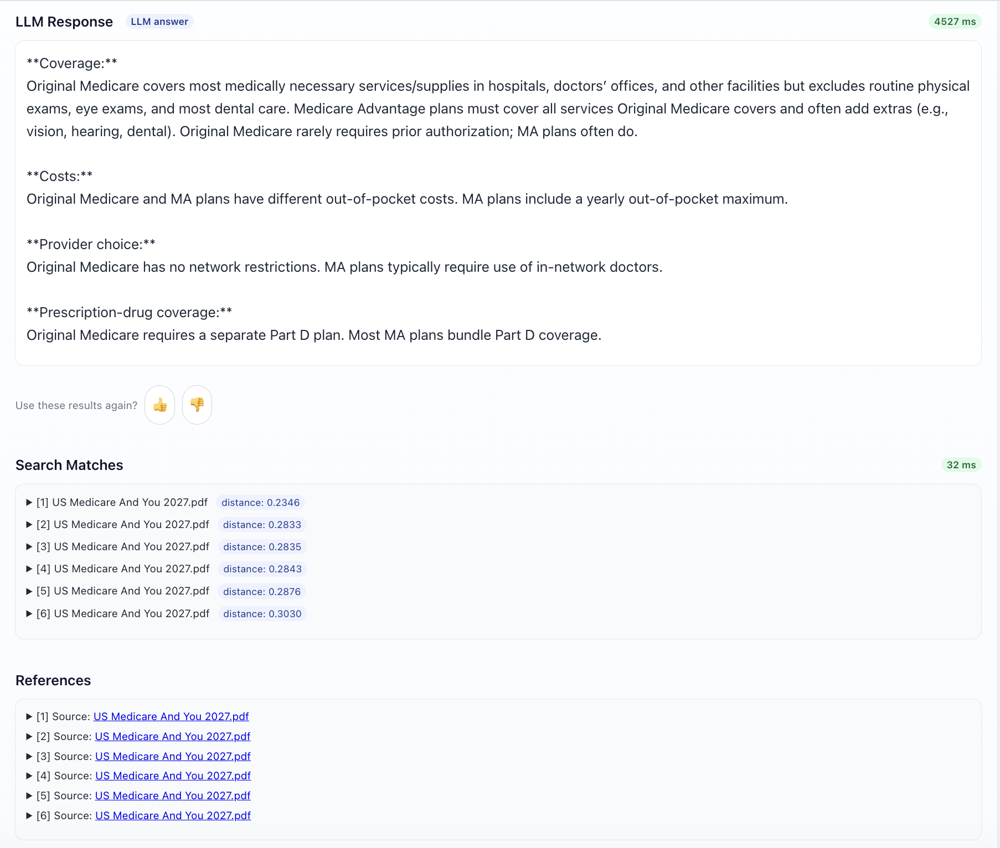
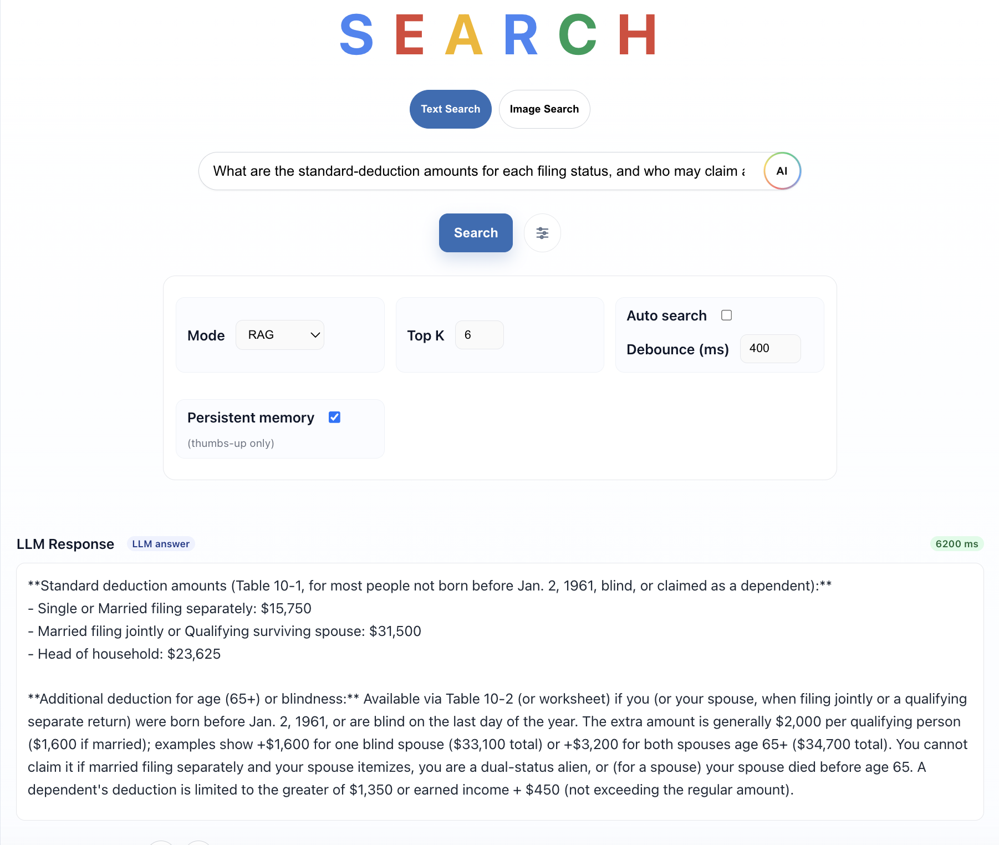
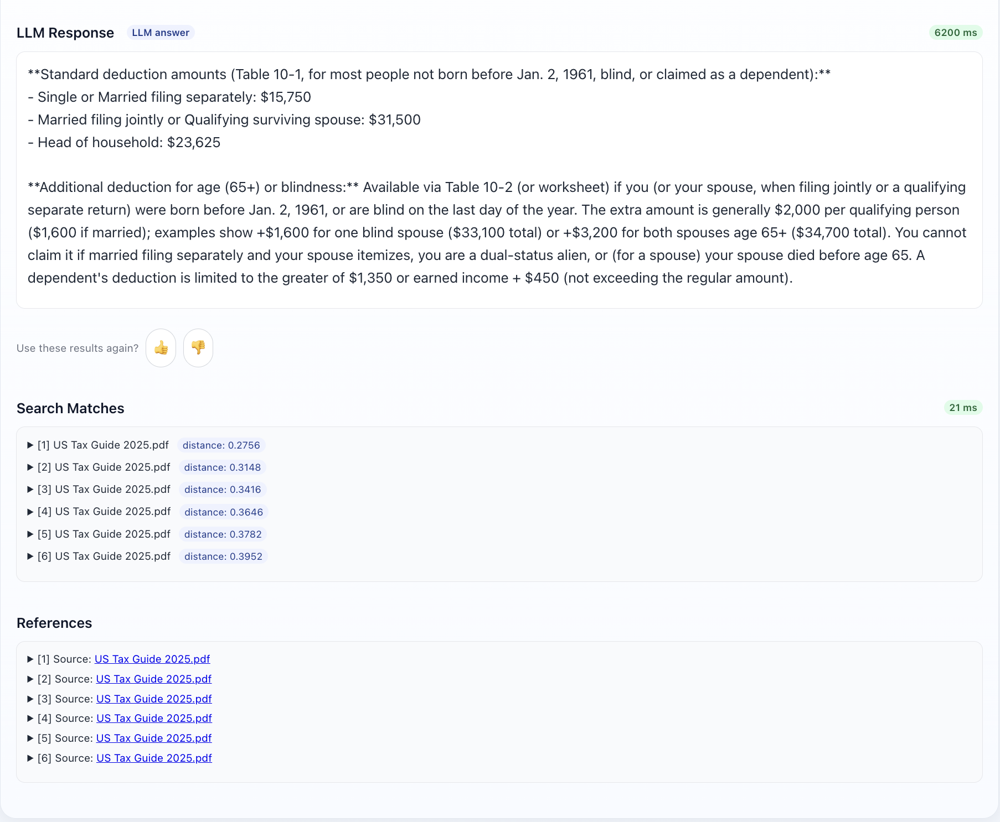

# Upload Files and Test the Search Application

## Introduction
In this lab, we will test what we created in Lab 1
Estimated time: 20 min

### Objectives

- Test the program

### Prerequisites
- The previous lab must have been completed.

## Task 1: Download RAG dataset
You will need samples files on your laptop/desktop. 

1. Use the code file PostgreSQL-AI.zip (from Task 3 step 1 in Lab 1)

1. Extract the PostgreSQL-AI.zip file to your computer. 
 

1. Note the directory contains the program runned in previous lab in the ***search-app*** folder, and samples files in the ***dataset*** folder.

## Task 2: Upload the sample files to the search app

You will load a file into the search app which will be parsed, chunked, vector embeddings created & ingested into the OCI PostgreSQL database. 
     
1. Go to the ##APP URL## (eg:http://<Public_IP>:8000/)

    Replace with your Public_IP (from Task 3 step 14 in Lab 1) in the URL
    
    Browse to the dataset folder and select both the sample files, and then click *Upload*

    
    
    

2. Click on "Search Options", then ensure *RAG*  is selected as the Search Mode

     
       

3. Type "What are the key differences in coverage, costs, provider choice, and prescription-drug coverage between Original Medicare and Medicare Advantage?", and click on "Search"

    
    
   
4. Type "What are the standard-deduction amounts for each filing status, and who may claim an additional deduction because of age or blindness?", then *Search*

    
     
       
 
## Task 3: Optional - Test additional files
This is an optional test you can run with your own files. If you do this test, you will have more content in the database. If you're running short of time, then you can skip it or come back to it later.

**You may now proceed to the [next lab.](#next)**

## Known issues

None

## Acknowledgements

- **Created By/Date** - Shadab Mohammad, Master Principal Cloud Architect, January 2026
- **Last Updated By** - Kaushik Kundu, Master Principal Cloud Architect, September 2026

